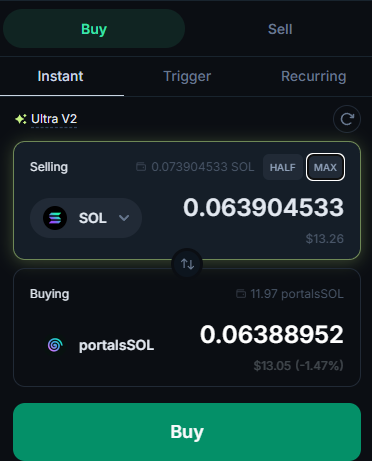

# Portals ID

## Benefits

The benefits of a Portals ID is two-fold.

One it allows you to reserve a "handle" in Portals.  No one else will be able to use your Portals ID handle except you.

The same Portals ID allows you to assign a custom URL slug to your&#x20;

## How to Purchase

Navigate to [https://theportal.to/portals-id](https://theportal.to/portals-id)

Click on the "Connect" button.

<figure><figcaption></figcaption></figure>

Once your wallet is connected, you will be greeted with the Portals ID purchase screen

<figure><figcaption></figcaption></figure>
